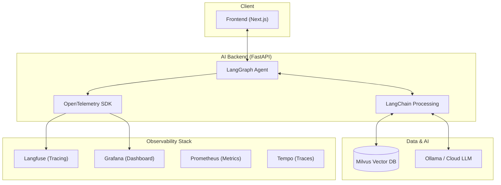

# 🤖 Senior AI Agent System (Learning System)

[](https://www.docker.com/)
[](https://www.python.org/)
[](https://nextjs.org/)
[](https://fastapi.tiangolo.com/)

Hệ thống AI Agent hiện đại được xây dựng dựa trên kiến trúc **RAG (Retrieval-Augmented Generation)**, tích hợp khả năng quan sát (Observability) toàn diện và sẵn sàng cho môi trường Production.

---

## 🏗️ Kiến trúc Hệ thống (System Architecture)



---

## 🚀 Tính năng nổi bật

- **🧠 Advanced RAG**: Truy xuất kiến trúc từ Milvus Vector Database để trả lời chính xác dựa trên dữ liệu nội bộ.
- **🛠️ LangGraph Orchestration**: Quản lý luồng suy nghĩ của Agent một cách linh hoạt và có kiểm soát.
- **📊 Full Observability**: Theo dõi từng "nhịp thở" của Agent qua Grafana, Loki (Log), Prometheus (Metrics) và Tempo (Traces).
- **🛡️ Production Ready**: Cấu hình Docker đa tầng, tối ưu hóa kích thước image và bảo mật Secrets.
- **⚡ High Performance**: Backend sử dụng `uv` (bộ quản lý thư viện nhanh nhất hiện nay) và Frontend Next.js Standalone mode.

---

## 🛠️ Công nghệ sử dụng (Tech Stack)

| Thành phần | Công nghệ |
|---|---|
| **Frontend** | Next.js 14+, Tailwind CSS, Vercel AI SDK |
| **Backend** | Python 3.11, FastAPI, LangChain, LangGraph |
| **Database** | Milvus (Vector), etcd, MinIO |
| **Observability** | Grafana, Prometheus, Tempo, Loki, Otel-Collector |
| **Tracing** | Langfuse (Standalone Version) |
| **DevOps** | Docker, Docker Compose, GitHub Actions |

---

## 💻 Hướng dẫn Cài đặt & Chạy (Quick Start)

### 1. Chuẩn bị (Prerequisites)
- Đã cài đặt **Docker** và **Docker Compose**.
- Đã clone dự án về máy: `git clone <your-repo-url>`

### 2. Cấu hình Biến môi trường (.env)
Copy file mẫu và điền thông tin của bạn (API Key, Mật khẩu...):
```bash
cp backend/.env.example backend/.env
```

### 3. Khởi chạy (Development mode)
```bash
docker compose up -d
```
Truy cập:
- **Frontend**: [http://localhost:3001](http://localhost:3001)
- **Backend API**: [http://localhost:8003](http://localhost:8003)
- **Grafana**: [http://localhost:3000](http://localhost:3000)
- **Langfuse**: [http://localhost:3002](http://localhost:3002)

---

## 🌍 Lộ trình đưa lên Production

Hệ thống đã sẵn sàng cho Production với cấu hình tối ưu:
1. **Dockerize**: Mọi dịch vụ được đóng gói tối ưu.
2. **Infrastructure**: Chạy trên VPS (CPU/GPU) với Nginx Reverse Proxy.
3. **CI/CD**: Tự động hóa quá trình deploy qua GitHub Actions.

---

## 🤝 Đóng góp (Contribution)
Mọi ý kiến đóng góp và Pull Request đều được chào đón! Hãy cùng nhau xây dựng một hệ thống AI Agent mã nguồn mở mạnh mẽ nhất.

---

## 📄 Giấy phép
Dự án được phát hành dưới giấy phép **MIT**.