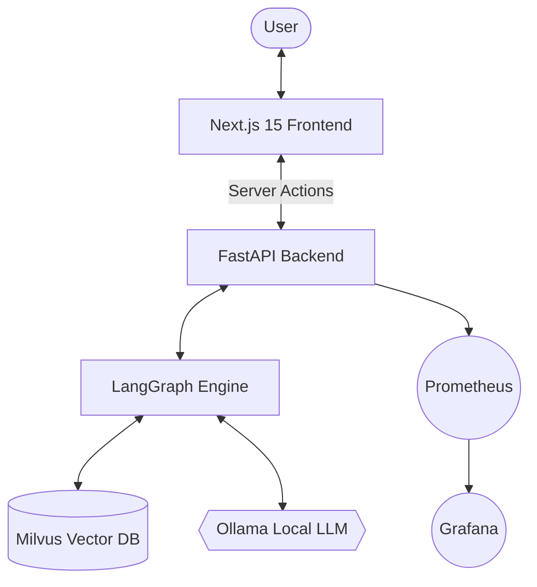

# Technology Stack: Senior AI Agent System (M4)

Detailed description of the technologies currently being used in the AI Agent system.

## 🏗 Overall Architecture



---

## 💻 Frontend Layer
Designed for maximum speed and a modern user experience.

- **Next.js 15 (App Router)**: The core framework supporting Server-Side Rendering (SSR) and Client-Side Interactivity.
- **Vercel AI SDK**: Handles complex streaming protocols and Generative UI (GenUI).
- **Server Actions**: Enables direct Server-Client communication without traditional REST APIs, minimizing latency.
- **Lucide React**: A consistent and clean iconography library.

---

## ⚙️ Backend Layer
A specialized Python service layer for AI reasoning.

- **FastAPI**: A high-performance web framework supporting asynchronous processing.
- **LangGraph**: The "brain" of the Agent, orchestrating Retrieval and Generation (RAG) workflows.
- **Pydantic (v2)**: Robust data validation and configuration management via `pydantic-settings`.
- **Singleton Pattern**: Intelligent resource management for Vector Store and Embedding connections, ensuring they are initialized only once.

---

## 🧠 AI & Vector Layer
Cores intelligence components running entirely locally.

- **Ollama (Gemma 2)**: A powerful Large Language Model (LLM) running locally, providing high-quality reasoning without external API costs.
- **Ollama (Nomic Embed)**: Text-to-vector embedding technology for precise semantic search.
- **Milvus Standalone**: A production-grade vector database, optimized for large-scale information retrieval.

---

## 📊 Infrastructure & Monitoring
Production-ready system setup.

- **Docker Compose**: Orchestrates all services (Milvus, Prometheus, Grafana).
- **Prometheus**: Collects real-time metrics (latency, request counts).
- **Grafana**: Visual dashboards for monitoring Agent performance and health.
- **uv**: The fastest Python package manager available today, allowing for dependency installation in seconds.

---

## 📁 Professional Folder Structure
The backend is organized for scalability:
```text
backend/app/
├── api/            # Separate API Routers & Endpoints
├── core/           # Centralized Config, Secrets, Monitoring
├── db/             # Vector Store Connections (Milvus)
├── engine/         # AI Logic & Workflows (LangGraph)
├── schemas/        # Request/Response Data Definitions
└── main.py         # Application Entry Point
```
